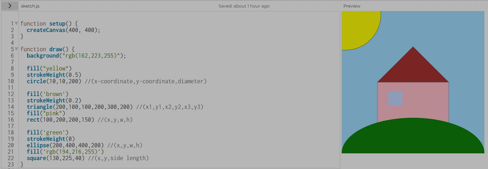
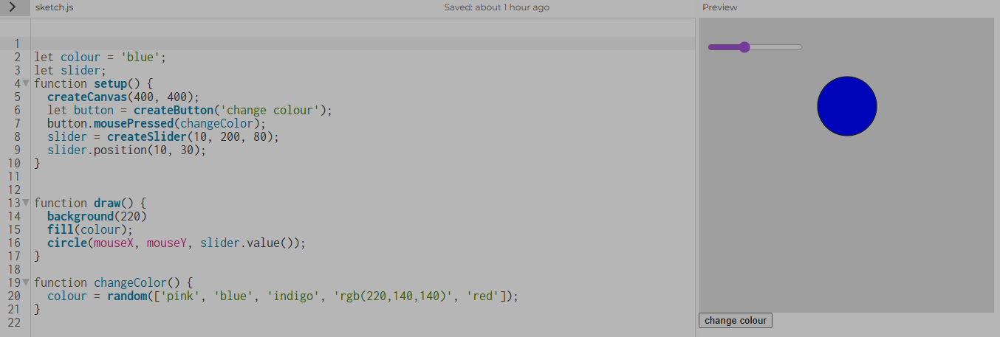
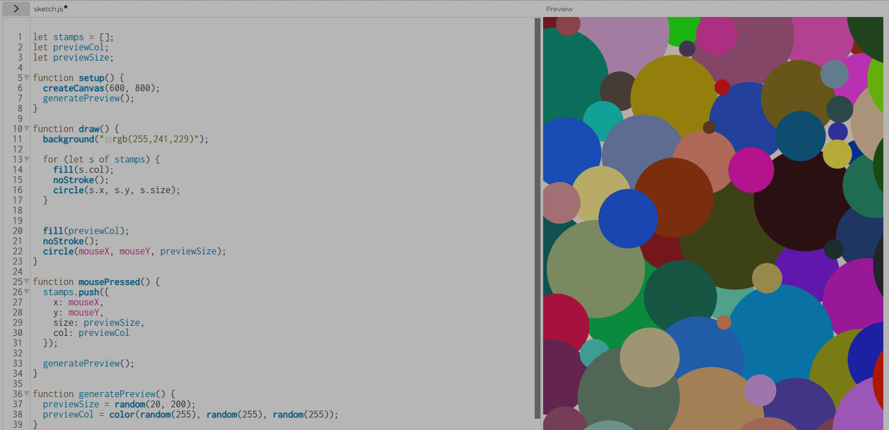

# Week 02 - Interactive Data Portrait

[← Back to Home](../index.md)

## Studio Exercise

Activity 1: Drawing with Code

We were told to get familiar with the p5.js editor, creating a simple composition using at least three different shapes, and experimenting with colour, size, and position.

I wanted to have a good idea of how to use most of the shapes so I did more than three and added some comments for notes about how the shapes worked.

*Activity 1*

Activity 2: Make an Interactive Sketch

For Activity 2 we were told to using the DOM elements covered in class (createButton(), createSlider(), createInput()), create a sketch with at least two interactive controls that change something on the canvas.

I used two DOM elements that were covered in class, createButton(), createSlider(), the button changed the colour of the circle, and the slider changed the size.

*Activity 2*

Activity 3: Vibe Code an Interactive Sketch

For this activity we were told to use an LLM (e.g. Gemini, ChatGPT, Claude) to help build a more ambitious interactive sketch in p5.js.

So I asked Copilot how to create a sketch that let me stamp circles on the page and would try to replicate the code it gave me without copying and pasting to gain a better idea of how to code, while still asking Copilot for help to understand why something was not working.

After I successfully did that I added another step onto each prompt after successfully completing the one new addition, colour randomisation, size randomisation, and how to make it so you could see the colour and size when hovering your mouse instead of only seeing it after stamping it on the canvas.

I learn that you always have to define what something is before using it for example, "let stamp=[]". 

*Activity 3*

## Independent Study: Interactive Data Portrait
Overview

For this task I took the data that I collected for Experiment 1 and use it as the basis my interactive p5.js sketch.

Step 1: Translate your data drawing into code
Looking at the data I wanted to represent how much and the type of liquid intake on different days in my p5.js sketch. I could do this by havīng coloured stamps to represent the different types of drinks I drank and stamp them in a line to form columns to represent different days.and have people interact by stamping them in a line to form columns.

Step 2: Design your interactive visualisation

Create a p5.js sketch that includes interactive elements that allow the viewer to explore your data. Use DOM elements (e.g. buttons, sliders, text inputs, dropdowns, checkboxes) to give the viewer control over what they encounter.

Consider:

What can interaction reveal that your hand-drawn portrait could not?
How do your controls relate to the structure of your data?
What happens when the viewer changes something? Is the response immediate, gradual, surprising?
Use the p5.js referenceLinks to an external site. and tutorialsLinks to an external site. to learn new techniques. 

Vibe coding is a legitimate creative workflow. You can use LLMs to help you build features beyond what was covered in class. Make sure to document your process and explain what you learn.

Step 3: Iterate

Test your sketch. Show it to someone else and observe how they use it. Refine the interaction based on what you observe.